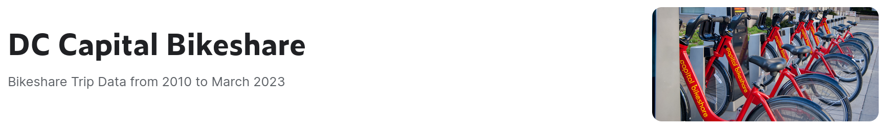

# DC Cycling Data _(dc-bike)_

#### By [Alejandro Socarras](https://alexsocarras.com)

##### ***WORK IN PROGRESS***

--- 

ETL pipeline extracting trip data from Washignton DC's Capital Bikeshare API and Open Data DC data portal.

### [Kaggle Dataset](https://www.kaggle.com/datasets/alexsocarras/dc-capital-bikeshare)



### [Dashboard] (TO-DO)

### _**Technologies Used**_ 
* ~~Google Cloud Platform~~
  * ~~BigQuery, Cloud Functions, Cloud Scheduler, Looker Studio, GCP SDK~~ -- *Shifting to AWS*
* Python 
* SQL
* Looker Studio
* AWS (Python SDK, S3, Athena, Lambda)
  
## Project Structure (WIP)
```bash
├── bikeshare 
│   ├── api_data_sources.ipynb # description of API structure 
│   ├── bks_cdc_streaming.ipynb # CDC/real-time data updates 
│   └── historical_data.ipynb # downloading/uploading historical data (see Kaggle)
├── crashes 
│   └── scrap.ipynb # sandboxing DC OpenData Crash Data 
├── data 
├── img 
├── README.md
└── requirements.txt
```

## Data Sources
[Capital Bikeshare](https://capitalbikeshare.com/system-data): DC's public bikeshare program provides its data in a real-time basis via its API and aggregated in .csv files updated every month.

[Open Data DC](https://opendata.dc.gov/): This data portal provides data on traffic accidents (including bicycles) and other metrics relevant for cycling in the city. 

## Setup/Installation Requirements

(TO-DO)

## Known Bugs

* No known bugs


## License

MIT License

Copyright (c) 2023 Alejandro Socarras

Permission is hereby granted, free of charge, to any person obtaining a copy of this software and associated documentation files (the "Software"), to deal in the Software without restriction, including without limitation the rights to use, copy, modify, merge, publish, distribute, sublicense, and/or sell copies of the Software, and to permit persons to whom the Software is furnished to do so, subject to the following conditions:

The above copyright notice and this permission notice shall be included in all copies or substantial portions of the Software.

THE SOFTWARE IS PROVIDED "AS IS", WITHOUT WARRANTY OF ANY KIND, EXPRESS OR IMPLIED, INCLUDING BUT NOT LIMITED TO THE WARRANTIES OF MERCHANTABILITY, FITNESS FOR A PARTICULAR PURPOSE AND NONINFRINGEMENT. IN NO EVENT SHALL THE AUTHORS OR COPYRIGHT HOLDERS BE LIABLE FOR ANY CLAIM, DAMAGES OR OTHER LIABILITY, WHETHER IN AN ACTION OF CONTRACT, TORT OR OTHERWISE, ARISING FROM, OUT OF OR IN CONNECTION WITH THE SOFTWARE OR THE USE OR OTHER DEALINGS IN THE SOFTWARE.

</br>
